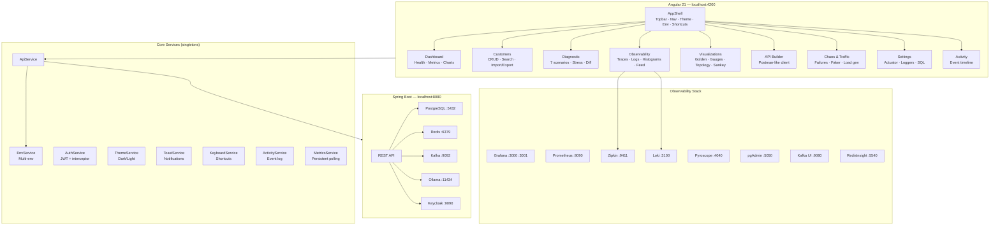

# Customer Observability UI

Angular 21 frontend for the [`customer-service`](../workspace-modern/customer-service) Spring Boot backend. Provides full observability, management, diagnostics, chaos testing, and advanced visualizations — all from the browser.

## Architecture



---

## Quick start

```bash
# 1. Start the backend
cd ../workspace-modern/customer-service
docker compose up -d
docker compose -f docker-compose.observability.yml up -d
./mvnw spring-boot:run

# 2. Start the UI
cd ../customer-observability-ui
npm install
npm start          # http://localhost:4200
```

Sign in with **admin / admin**.

---

## User Manual

### 1. Dashboard

The home page. Shows the backend health at a glance.

**Stats cards** — Total customers, HTTP request count, latency percentiles (p50/p95/p99) from Prometheus.

**Live throughput chart** — Click "Start live chart" to see a bar chart of requests/second updating every 3s. The chart **persists when you navigate** to other pages (backed by `MetricsService` singleton).

**Health probes** — Three cards for `/actuator/health`, `/readiness`, `/liveness`. Each shows UP/DOWN badge and raw JSON. The sparkline above tracks health status over time.

**Auto-refresh** — Toggle 10s / 30s / 1min polling. Toast notifications fire when backend health changes (UP -> DOWN or vice versa).

**Dependency graph** — SVG graph of backend services (API, PostgreSQL, Redis, Kafka, Ollama, Keycloak) with color-coded health status. Click "Check status" to refresh.

**Request heatmap** — 24-hour grid showing request volume distribution. Intensity = traffic volume.

**Before/After comparator** — Take "Snapshot A", make changes, take "Snapshot B". The table shows the diff with percentage change for each metric.

**Latency comparator** — Select two environments, set number of pings, compare avg/p95 latency and error rate side by side.

**Observability links** — One-click access to Grafana, Prometheus, Zipkin, Pyroscope, Swagger, pgAdmin, Kafka UI, RedisInsight, Keycloak.

### 2. Customers

Full CRUD with advanced features.

**Search** — Type in the search box. Debounced at 300ms, queries the backend.

**Sort** — Click any column header (ID, Name, Email, CreatedAt). Click again to reverse.

**Create** — Fill name + email in the left panel. Toggle "Idempotency-Key" to test replay safety.

**Edit** — Click "Edit" on any row. Modal form with save/cancel.

**Delete** — Click "Del" on a row, confirm in the modal. Or select multiple rows with checkboxes and "Delete selected" for batch delete.

**API Versioning** — Toggle v1.0 / v2.0. v2.0 adds the `createdAt` column.

**Views** — "Full" shows all fields, "Summary" shows only id + name (SELECT projection).

**Per-customer actions** — Click Bio (Ollama LLM), Todos (JSONPlaceholder), or Enrich (Kafka request-reply) to open the detail panel with tabs.

**Export** — "JSON" or "CSV" buttons download the current page data.

**Import** — "Import" button opens a file picker. Upload a `.json` array or `.csv` file. Progress bar shows creation status. Report shows ok/errors count.

**Recent (Redis)** — Shows the last 10 created customers from the Redis ring buffer.

**Aggregate** — Runs two parallel tasks via Java virtual threads and shows the result.

### 3. Diagnostic

Seven interactive scenarios with terminal-style colored logs.

| Scenario | What it tests |
|---|---|
| **API Versioning** | Side-by-side v1 vs v2 response comparison |
| **Idempotency** | Same key sent twice, verifies cached response |
| **Rate Limiting** | Burst N concurrent requests, observe 429s |
| **Kafka Enrich** | Request-reply timing, 504 on timeout |
| **Virtual Threads** | Parallel task execution time |
| **Version Diff** | Colored diff (green = added, red = removed) between v1 and v2 |
| **Stress Test** | Sustained load: configurable duration, concurrency, endpoint. Live SVG chart of throughput + errors |

**Run All** — Executes all 7 scenarios sequentially.

**History** — Toggle "History" to see past runs with timestamps and durations. "Export" downloads as JSON.

### 4. Observability

Four tabs for live backend telemetry.

**Traces** — Queries Zipkin/Tempo API. Shows trace list with operation, duration, span count. Click to expand span waterfall. "Flame" button opens a flame graph view.

**Logs** — Queries Loki with LogQL. Color-coded by level (ERROR=red, WARN=yellow, INFO=green, DEBUG=blue). "Live" button polls every 5s.

**Latency** — Fetches Prometheus histogram buckets and renders a bar chart of latency distribution.

**Live Feed** — Polls `/actuator/prometheus` every 2s and displays a scrolling feed of endpoint metrics (method, URI, status).

### 5. Visualizations

Nine advanced visualization tabs.

**Golden Signals** — The 4 SRE golden signals: Latency (p95), Traffic (total requests), Errors (5xx rate), Saturation (thread count). Color-coded: green=ok, yellow=warn, red=critical.

**JVM Gauges** — Circular gauge charts for Heap Memory, CPU Usage, Live Threads, GC Pause. Values from `/actuator/prometheus` JVM metrics.

**Topology** — Animated service dependency map. "Animate traffic" sends colored particles along edges to visualize request flow. Nodes are color-coded by health status.

**Waterfall** — Fires 6 parallel requests and renders them as horizontal bars (like Chrome DevTools Network tab). Shows start offset, duration, and status for each.

**Sankey** — Flow diagram from endpoint to HTTP status (2xx/4xx/5xx). Bar width proportional to request volume. Built from Prometheus metrics.

**Error Timeline** — Live stacked bar chart showing OK vs error responses over time. Polls every 3s.

**Kafka Lag** — Line chart of consumer lag over time. Polls every 5s.

**Slow Queries** — Parses Spring Data repository metrics from Prometheus. Shows query method, average duration, and call count.

**Bundle** — Treemap showing the relative size of each Angular lazy chunk. 3D block view with CSS transforms.

### 6. API Builder

Postman-like HTTP client built into the app.

**Presets** — 13 pre-configured requests (health, customers CRUD, bio, todos, enrich, aggregate, prometheus, loggers). Click to load.

**Request form** — Method selector (GET/POST/PUT/DELETE/PATCH), URL input, headers textarea (one per line), body textarea for POST/PUT.

**Response** — Shows status code (color-coded), response time, collapsible headers, and formatted body in a terminal-style panel.

**History** — Last 20 requests. Click to replay.

### 7. Chaos & Traffic

Simulate failures and generate realistic traffic.

**Chaos actions:**
- **Exhaust Rate Limit** — 120 rapid requests to exceed the 100/min bucket
- **Kafka Timeout** — Triggers the 5s enrich timeout
- **Circuit Breaker Trip** — 10 rapid /bio calls to trip Ollama's circuit breaker
- **Invalid Payload Flood** — 50 empty POST requests for validation errors
- **Concurrent Writes** — 20 simultaneous customer creates
- **Generate Traffic** — Mixed GET/POST traffic for N seconds

**Impact monitor** — Real-time chart showing OK vs error responses (polls every 2s). Start it before running chaos actions to see the impact.

**Faker generator** — Creates N customers with realistic random names and emails. Configurable count (1-500) and delay between requests.

### 8. Settings

Backend configuration explorer.

**Config properties** — Lists relevant properties from `/actuator/env` (rate limit, Kafka, circuit breaker, etc.).

**Actuator explorer** — Click any endpoint button (Health, Info, Env, Beans, Metrics, Loggers, Prometheus) to see the raw response.

**Loggers** — Browse all Spring loggers. Filter by name. Click a level button (TRACE/DEBUG/INFO/WARN/ERROR) to change it live via POST.

**SQL Explorer** — Execute SQL queries against the backend (requires a `/sql` endpoint). Preset queries included. Falls back to pgAdmin link if unavailable.

### 9. Activity

Chronological event timeline for the current session.

Events logged: customer create/update/delete, health state changes, diagnostic runs, environment switches, bulk imports.

**Filters** — Click type badges to filter (All, Create, Update, Delete, Health, Diagnostic, Environment, Import).

**Clear** — Resets the timeline.

### 10. Login

JWT authentication form. Default credentials: **admin / admin**.

---

## Keyboard Shortcuts

| Shortcut | Action |
|---|---|
| `Ctrl+K` | Open global search |
| `?` | Show shortcuts help |
| `G D` | Go to Dashboard |
| `G C` | Go to Customers |
| `G T` | Go to Diagnostic |
| `G S` | Go to Settings |
| `G A` | Go to Activity |
| `R` | Refresh current page |
| `D` | Toggle dark/light mode |
| `Escape` | Close modal / search |

## Dark Mode

Click the moon/sun icon in the topbar, or press `D`. Persisted in localStorage.

## Multi-Environment

Click the environment badge in the topbar to switch between Local, Docker, Staging, Production. All API calls immediately use the new base URL.

## Port Map

| Service | URL |
|---|---|
| This UI | http://localhost:4200 |
| Backend API | http://localhost:8080 |
| Swagger UI | http://localhost:8080/swagger-ui.html |
| Grafana (metrics) | http://localhost:3000 |
| Grafana LGTM (traces/logs) | http://localhost:3001 |
| Prometheus | http://localhost:9090 |
| Zipkin / Tempo | http://localhost:9411 |
| Pyroscope | http://localhost:4040 |
| Loki | http://localhost:3100 |
| pgAdmin | http://localhost:5050 |
| Kafka UI | http://localhost:9080 |
| RedisInsight | http://localhost:5540 |
| Keycloak | http://localhost:9090/admin |

## CI/CD

### GitLab CI

`.gitlab-ci.yml` runs 7 jobs across 4 stages:

| Stage | Job | What it does |
|---|---|---|
| validate | `typecheck` | `tsc --noEmit` strict compilation |
| validate | `lint:format` | Prettier check |
| validate | `lint:circular-deps` | Circular import detection |
| test | `unit-tests` | Vitest (22 tests) on Node 22 |
| test | `unit-tests:node20` | Same on Node 20 |
| build | `build:production` | Production bundle + size analysis |
| quality | `bundle-size-check` | Bundle budget verification |
| quality | `security:audit` | npm audit + sensitive file scan |

### Pre-push Hook

Git pre-push hook runs `scripts/pre-push-checks.sh` automatically before every push.

```bash
npm run check        # standard mode (typecheck + prettier + tests + build)
npm run check:quick  # fast mode (typecheck + prettier + tests, no build)
npm run check:full   # full mode (+ npm audit + bundle analysis + secrets scan)
```

Checks performed:
- Working tree clean
- No merge conflict markers
- No sensitive files (.env, .pem, .key)
- No oversized files (>500KB)
- TypeScript strict compilation
- Prettier formatting
- No TODO/FIXME/HACK comments
- No console.log statements
- Unit tests pass
- Production build succeeds
- No circular dependencies
- npm audit (--full mode)
- Bundle size budget (--full mode)

## Build

```bash
npm run build        # production bundle -> dist/
npm test             # vitest unit tests (22 tests)
npm run format       # auto-fix formatting
npm run typecheck    # standalone type check
```

## Tech Stack

- **Angular 21** — Standalone, zoneless, signals-based
- **Vitest** — Unit testing
- **Prettier** — Code formatting
- **TypeScript 5.9** — Strict mode
- **SCSS** — CSS custom properties for theming
- **PWA** — Web manifest for standalone install
