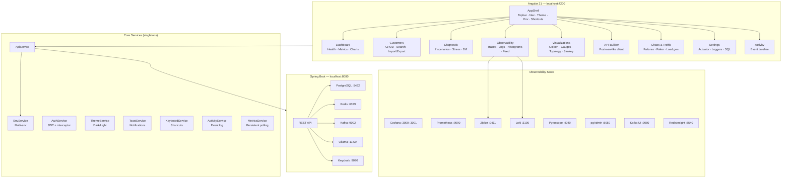

> Angular 21 frontend for the [`mirador-service`](https://gitlab.com/mirador1/mirador-service) Spring Boot backend.
> Provides full observability, management, diagnostics, chaos testing, and advanced visualizations — all from the browser.

---

## Table of Contents

- [Architecture](#architecture)
- [Project Structure](#project-structure)
- [Quick Start](#quick-start)
- [run.sh Reference](#runsh-reference)
- [Environment Configuration](#environment-configuration)
- [Core Services](#core-services)
- [User Manual](#user-manual)
- [Keyboard Shortcuts](#keyboard-shortcuts)
- [Dark Mode](#dark-mode)
- [Multi-Environment](#multi-environment)
- [Port Map](#port-map)
- [Proxy Configuration](#proxy-configuration)
- [Docker Control API](#docker-control-api)
- [CI/CD](#cicd)
- [Build & Quality](#build--quality)
- [Tech Stack](#tech-stack)

---

## Architecture



---

## Project Structure

```
customer-observability-ui/
├── src/
│   ├── main.ts                          # Application bootstrap (zoneless)
│   ├── styles.scss                      # Global styles + CSS custom properties
│   ├── app/
│   │   ├── app.ts                       # Root component (renders AppShell)
│   │   ├── app.config.ts                # Angular providers (zoneless, router, HTTP + JWT interceptor)
│   │   ├── app.routes.ts                # Lazy-loaded feature routes (10 pages)
│   │   ├── core/                        # Singleton services (provided in root)
│   │   │   ├── api/api.service.ts       # HTTP client — all backend REST calls
│   │   │   ├── auth/auth.service.ts     # JWT token management (signal-based)
│   │   │   ├── auth/auth.interceptor.ts # Attaches Bearer token to outgoing requests
│   │   │   ├── env/env.service.ts       # Multi-environment URL switching
│   │   │   ├── theme/theme.service.ts   # Dark/light mode toggle (persisted)
│   │   │   ├── toast/toast.service.ts   # Ephemeral notification system
│   │   │   ├── keyboard/keyboard.service.ts # Global keyboard shortcuts (Vim-style G+key)
│   │   │   ├── activity/activity.service.ts # In-session event timeline
│   │   │   └── metrics/metrics.service.ts   # Prometheus polling + percentile computation
│   │   ├── features/                    # Lazy-loaded page components
│   │   │   ├── dashboard/              # Health, stats, charts, dependency graph
│   │   │   ├── customers/              # Full CRUD, search, sort, import/export, batch ops
│   │   │   ├── diagnostic/            # 7 test scenarios + stress test + history
│   │   │   ├── observability/         # Traces (Zipkin), Logs (Loki), Latency, Live feed
│   │   │   ├── visualizations/        # 9 viz tabs (Golden, Gauges, Topology, Sankey...)
│   │   │   ├── chaos/                 # Failure injection + traffic generation + faker
│   │   │   ├── request-builder/       # Postman-like HTTP client with presets
│   │   │   ├── settings/             # Actuator explorer, loggers, SQL
│   │   │   ├── activity/             # Session event timeline with filters
│   │   │   └── login/                # JWT authentication form
│   │   └── shared/                    # Reusable UI components
│   │       ├── layout/app-shell.component.ts  # Main layout (topbar, sidebar, router outlet)
│   │       └── info-tip/info-tip.component.ts # Contextual tooltip popover
│   └── public/                        # Static assets (favicon, manifest)
├── scripts/
│   ├── docker-api.mjs                  # Node.js server — Docker control + Zipkin/Loki proxy
│   └── pre-push-checks.sh             # Git pre-push quality gate
├── run.sh                              # Full-stack launcher (frontend + backend delegation)
├── proxy.conf.json                     # Angular dev server proxy rules
├── angular.json                        # Angular CLI workspace config
├── tsconfig.json                       # TypeScript base config
├── tsconfig.app.json                   # App-specific TS config
└── tsconfig.spec.json                  # Test-specific TS config
```

---

## Quick Start

### Prerequisites

| Tool | Version | Install |
|---|---|---|
| **Node.js** | 22 LTS | [nodejs.org](https://nodejs.org) or `nvm install 22` |
| **npm** | 10 | bundled with Node 22 |
| **Docker Desktop** | 4.x | [docker.com/products/docker-desktop](https://www.docker.com/products/docker-desktop/) |
| **Java** | 17 / 21 / 25 (default: 25) | [sdkman.io](https://sdkman.io) `sdk install java 25-open` |
| **Git** | any | pre-installed on most systems |

> Both repos must live as siblings (the frontend's `run.sh` locates the backend by relative path):
> ```
> dev/
>   workspace-modern/mirador-service/   ← backend
>   js/mirador-ui/                       ← this repo (frontend)
> ```

---

### First-time setup — complete stack

```bash
# Clone both repos (run from your dev root)
git clone https://gitlab.com/benoit.besson/mirador-service.git workspace-modern/mirador-service
git clone https://gitlab.com/benoit.besson/mirador-ui.git js/mirador-ui

# Start everything — one command
bash js/mirador-ui/run.sh
```

Docker starts automatically. Sign in with **admin / admin** at http://localhost:4200.

> **Backend only:**
> ```bash
> bash workspace-modern/mirador-service/run.sh all
> # → API at http://localhost:8080/swagger-ui.html  (admin/admin)
> ```

---

## run.sh Reference

The `run.sh` script at the project root orchestrates the full stack. It delegates infrastructure commands to the backend's own `run.sh` rather than duplicating Docker Compose logic.

| Command | Description |
|---|---|
| `./run.sh` or `./run.sh all` | Start everything: backend (infra + obs + app) + frontend |
| `./run.sh frontend` | Frontend only (`npm start` + Docker API server) |
| `./run.sh backend` | Backend only (infra + observability + Spring Boot) |
| `./run.sh infra` | Infrastructure containers only (PostgreSQL, Kafka, Redis) |
| `./run.sh obs` | Observability stack (Prometheus, Grafana, Zipkin, Loki...) |
| `./run.sh app` | Spring Boot application only |
| `./run.sh simulate` | Run backend traffic simulation scripts |
| `./run.sh restart` | Stop + restart everything |
| `./run.sh stop` | Stop all services (frontend + backend) |
| `./run.sh nuke` | Full cleanup (containers, volumes, caches, dist, node_modules cache) |
| `./run.sh status` | Show UP/DOWN status of all services |
| `./run.sh check` | Pre-push checks: typecheck + prettier + tests + build |
| `./run.sh check:quick` | Fast checks: typecheck + prettier + tests (no build) |
| `./run.sh check:full` | Full checks: + npm audit + bundle analysis + secrets scan |

The frontend start flow: `npm ci` (if needed) -> start Docker API server on :3333 -> `ng serve` on :4200.

---

## Environment Configuration

Copy `.env.example` to `.env` and customize if your ports differ from defaults:

```bash
cp .env.example .env
```

The `.env` file is gitignored — only `.env.example` is committed. Variables used by `run.sh` and `scripts/pre-push-checks.sh`:

| Variable | Default | Used by |
|---|---|---|
| `BACKEND_URL` | `http://localhost:8080` | run.sh, env selector |
| `FRONTEND_PORT` | `4200` | run.sh status |
| `GRAFANA_PORT` | `3000` | run.sh status |
| `PROMETHEUS_PORT` | `9090` | run.sh status |
| `ZIPKIN_PORT` | `9411` | proxy, observability |
| `LOKI_PORT` | `3100` | proxy, observability |
| `PYROSCOPE_PORT` | `4040` | run.sh status |
| `PGADMIN_PORT` | `5050` | run.sh status |
| `KAFKA_UI_PORT` | `9080` | run.sh status |
| `REDIS_INSIGHT_PORT` | `5540` | run.sh status |
| `KEYCLOAK_PORT` | `9090` | run.sh status |

---

## Core Services

All services are Angular singletons (`providedIn: 'root'`) using signals for reactive state.

| Service | File | Role |
|---|---|---|
| **ApiService** | `core/api/api.service.ts` | Central HTTP client for all backend REST endpoints (customers CRUD, health, actuator, Kafka enrich, Ollama bio, etc.). Uses `EnvService` for dynamic base URL. |
| **AuthService** | `core/auth/auth.service.ts` | Manages JWT token in a signal + localStorage. Exposes `isAuthenticated` computed signal. |
| **Auth Interceptor** | `core/auth/auth.interceptor.ts` | Functional HTTP interceptor that attaches `Authorization: Bearer <token>` to all requests except login, docker-api, and proxy routes. |
| **EnvService** | `core/env/env.service.ts` | Manages the active backend environment (Local / Docker / Staging / Prod). Persisted in localStorage. All API calls dynamically use `env.baseUrl()`. |
| **ThemeService** | `core/theme/theme.service.ts` | Dark/light toggle. Sets `data-theme` attribute on `<html>` via an `effect()`. Persisted in localStorage. |
| **ToastService** | `core/toast/toast.service.ts` | Ephemeral notification toasts with auto-dismiss (4s default). Supports success, error, warn, info types. |
| **KeyboardService** | `core/keyboard/keyboard.service.ts` | Global keyboard shortcut handler. Supports Vim-style two-key sequences (`G` then `D` for Dashboard). Ignores shortcuts when focus is in input fields. |
| **ActivityService** | `core/activity/activity.service.ts` | In-memory event log (last 200 events). Tracks CRUD operations, health changes, diagnostic runs, imports. |
| **MetricsService** | `core/metrics/metrics.service.ts` | Persistent Prometheus polling (3s interval). Parses raw Prometheus text format to extract HTTP request counts and latency percentiles (p50/p95/p99) from histogram buckets. Singleton state survives navigation. |

---

## User Manual

### 1. Dashboard

The home page. Shows the backend health at a glance.

**Stats cards** — Total customers, HTTP request count, latency percentiles (p50/p95/p99) from Prometheus.

**Live throughput chart** — Click "Start live chart" to see a bar chart of requests/second updating every 3s. The chart **persists when you navigate** to other pages (backed by `MetricsService` singleton).

**Health probes** — Three cards for `/actuator/health`, `/readiness`, `/liveness`. Each shows UP/DOWN badge and raw JSON. The sparkline above tracks health status over time.

**Auto-refresh** — Toggle 1s / 5s / 10s / 30s polling. Toast notifications fire when backend health changes (UP -> DOWN or vice versa).

**Docker service control** — Lists all Docker containers with their status. Start/stop/restart containers directly from the UI via the Docker API server (port 3333).

**Dependency graph** — SVG graph of backend services (API, PostgreSQL, Redis, Kafka, Ollama, Keycloak) with color-coded health status (green=UP, red=DOWN, gray=unknown). Status derived from `/actuator/health` components + Docker container state.

**Quick traffic generator** — Fires 10 requests across various endpoints (including slow ones: bio, enrich, aggregate) to populate metrics.

**Request heatmap** — 24-hour grid showing request volume distribution. Intensity = traffic volume.

**Before/After comparator** — Take "Snapshot A", make changes, take "Snapshot B". The table shows the diff with percentage change for each metric (customers, requests, latency p50/p95/p99).

**Observability links** — One-click access to Grafana, Prometheus, Zipkin, Pyroscope, Swagger, pgAdmin, Kafka UI, RedisInsight, Keycloak.

### 2. Customers

Full CRUD with advanced features.

**Search** — Type in the search box. Debounced at 300ms, queries the backend.

**Sort** — Click any column header (ID, Name, Email, CreatedAt). Click again to reverse.

**Create** — Fill name + email in the left panel. Toggle "Idempotency-Key" to test replay safety.

**Edit** — Click "Edit" on any row. Modal form with save/cancel.

**Delete** — Click "Del" on a row, confirm in the modal. Or select multiple rows with checkboxes and "Delete selected" for batch delete.

**API Versioning** — Toggle v1.0 / v2.0. v2.0 adds the `createdAt` column.

**Views** — "Full" shows all fields, "Summary" shows only id + name (SELECT projection).

**Per-customer actions** — Click Bio (Ollama LLM), Todos (JSONPlaceholder), or Enrich (Kafka request-reply) to open the detail panel with tabs.

**Export** — "JSON" or "CSV" buttons download the current page data.

**Import** — "Import" button opens a file picker. Upload a `.json` array or `.csv` file. Progress bar shows creation status. Report shows ok/errors count.

### 3. Diagnostic

Seven interactive scenarios with terminal-style colored logs.

| Scenario | What it tests |
|---|---|
| **API Versioning** | Side-by-side v1 vs v2 response comparison |
| **Idempotency** | Same key sent twice, verifies cached response |
| **Rate Limiting** | Burst N concurrent requests, observe 429s |
| **Kafka Enrich** | Request-reply timing, 504 on timeout |
| **Virtual Threads** | Parallel task execution time |
| **Version Diff** | Colored diff (green = added, red = removed) between v1 and v2 |
| **Stress Test** | Sustained load: configurable duration, concurrency, endpoint. Live SVG chart of throughput + errors |

**Run All** — Executes all 5 core scenarios sequentially (excludes Version Diff and Stress Test).

**History** — Toggle "History" to see past runs with timestamps and durations. "Export" downloads as JSON.

### 4. Observability

Four tabs for live backend telemetry.

**Traces** — Queries Zipkin API via the Docker API proxy (`/docker-api/zipkin/api/v2/traces`). Shows trace list with operation, duration, span count. Click to expand span waterfall. "Flame" button opens a flame graph view.

**Logs** — Queries Loki with LogQL via the Docker API proxy (`/docker-api/loki/loki/api/v1/query_range`). Color-coded by level (ERROR=red, WARN=yellow, INFO=green, DEBUG=blue). "Live" button polls every 5s.

**Latency** — Fetches Prometheus histogram buckets and renders a bar chart of latency distribution. Converts cumulative buckets to differential counts.

**Live Feed** — Polls `/actuator/prometheus` every 2s and displays a scrolling feed of endpoint metrics (method, URI, status).

### 5. Visualizations

Nine advanced visualization tabs.

**Golden Signals** — The 4 SRE golden signals: Latency (p95), Traffic (total requests), Errors (5xx rate), Saturation (thread count). Color-coded: green=ok, yellow=warn, red=critical. Thresholds: latency >500ms=critical, >100ms=warn; errors >5%=critical, >1%=warn.

**JVM Gauges** — Circular gauge charts (SVG arcs) for Heap Memory, CPU Usage, Live Threads, GC Pause. Values from `/actuator/prometheus` JVM metrics.

**Topology** — Animated service dependency map with 7 nodes (Browser, API, PostgreSQL, Redis, Kafka, Ollama, Kafka Consumer). "Animate traffic" sends colored particles along edges. Node health determined by `/actuator/health` + proxy checks to Kafka UI and Ollama.

**Waterfall** — Fires 6 parallel requests and renders them as horizontal bars (like Chrome DevTools Network tab). Shows start offset, duration, and status for each.

**Sankey** — Flow diagram from endpoint to HTTP status (2xx/3xx/4xx/5xx). Bar width proportional to request volume. Built from Prometheus `http_server_requests_seconds_count` metrics.

**Error Timeline** — Live stacked bar chart showing OK vs error responses over time. Polls every 3s by sending 5 probe requests.

**Kafka Lag** — Line chart (SVG path) of consumer lag over time. Polls every 5s from `kafka_consumer_fetch_manager_records_lag_max` metric.

**Slow Queries** — Parses `spring_data_repository_invocations_seconds` metrics from Prometheus. Shows query method, average duration, and call count.

**Bundle** — Treemap showing the relative size of each Angular lazy chunk. 3D block view with CSS transforms.

### 6. API Builder

Postman-like HTTP client built into the app.

**Presets** — 13 pre-configured requests (health, customers CRUD, bio, todos, enrich, aggregate, prometheus, loggers). Click to load.

**Request form** — Method selector (GET/POST/PUT/DELETE/PATCH), URL input, headers textarea (one per line: `Key: Value`), body textarea for POST/PUT.

**Response** — Shows status code (color-coded: green <300, blue 3xx, yellow 4xx, red 5xx), response time, collapsible headers, and formatted body in a terminal-style panel.

**History** — Last 20 requests. Click to replay.

### 7. Chaos & Traffic

Simulate failures and generate realistic traffic.

**Chaos actions:**
- **Exhaust Rate Limit** — 120 rapid requests to exceed the 100/min bucket
- **Kafka Timeout** — Triggers the 5s enrich timeout by calling `/customers/1/enrich`
- **Circuit Breaker Trip** — 10 rapid `/bio` calls to trip Ollama's circuit breaker
- **Invalid Payload Flood** — 50 empty POST requests for validation errors
- **Concurrent Writes** — 20 simultaneous customer creates
- **Generate Traffic** — Mixed GET/POST traffic for N seconds (configurable duration)

**Impact monitor** — Real-time chart showing OK vs error responses (polls every 2s with 5 health pings). Also shows live traffic breakdown from Prometheus with RPS calculation. Start it before running chaos actions to see the impact.

**Faker generator** — Creates N customers with realistic random names and emails. Configurable count (1-500) and delay between requests (ms). Abortable.

### 8. Settings

Backend configuration explorer.

**Config properties** — Lists relevant properties from `/actuator/env` (rate limit, timeout, circuit breaker, Kafka, resilience, server.port, spring.application).

**Actuator explorer** — Click any endpoint button (Health, Info, Env, Beans, Metrics, Loggers, Prometheus) to see the raw response. Prometheus endpoint returns plain text; others return formatted JSON.

**Loggers** — Browse all Spring loggers. Filter by name. Click a level button (TRACE/DEBUG/INFO/WARN/ERROR) to change it live via POST to `/actuator/loggers/{name}`.

**SQL Explorer** — Execute SQL queries against the backend (requires a `/sql` endpoint). 4 preset queries included. Falls back to pgAdmin link if the endpoint is unavailable.

### 9. Activity

Chronological event timeline for the current session.

Events logged: customer create/update/delete, health state changes, diagnostic runs, environment switches, bulk imports.

**Filters** — Click type badges to filter (All, Create, Update, Delete, Health, Diagnostic, Environment, Import).

**Clear** — Resets the timeline.

### 10. Login

JWT authentication form. Default credentials: **admin / admin**.

On successful login, stores the JWT token in localStorage and redirects to the dashboard. The auth interceptor automatically attaches the token to all subsequent API requests.

---

## Keyboard Shortcuts

| Shortcut | Action |
|---|---|
| `Ctrl+K` / `Cmd+K` | Open global search |
| `?` | Show shortcuts help |
| `G` then `D` | Go to Dashboard |
| `G` then `C` | Go to Customers |
| `G` then `T` | Go to Diagnostic |
| `G` then `S` | Go to Settings |
| `G` then `A` | Go to Activity |
| `R` | Refresh current page (dispatches `app:refresh` custom event) |
| `D` | Toggle dark/light mode |
| `Escape` | Close modal / search |

Shortcuts are disabled when focus is inside input, textarea, or select elements. The `G` key starts a 500ms sequence window — press the second key within that window.

## Dark Mode

Click the moon/sun icon in the topbar, or press `D`. Persisted in localStorage. Uses CSS custom properties (`--bg-primary`, `--text-primary`, etc.) defined in `styles.scss`, switched via `data-theme` attribute on `<html>`.

## Multi-Environment

Click the environment badge in the topbar to switch between Local, Docker, Staging, Production. All API calls immediately use the new base URL via `EnvService.baseUrl()` computed signal. Persisted in localStorage.

## Port Map

| Service | URL |
|---|---|
| This UI | http://localhost:4200 |
| Docker API (control + proxy) | http://localhost:3333 |
| Backend API | http://localhost:8080 |
| Swagger UI | http://localhost:8080/swagger-ui.html |
| Grafana (metrics) | http://localhost:3000 |
| Grafana LGTM (traces/logs) | http://localhost:3001 |
| Prometheus | http://localhost:9091 |
| Zipkin / Tempo | http://localhost:9411 |
| Pyroscope | http://localhost:4040 |
| Loki | http://localhost:3100 |
| pgAdmin | http://localhost:5050 |
| Kafka UI | http://localhost:9080 |
| RedisInsight | http://localhost:5540 |
| Keycloak | http://localhost:9090/admin |

## Proxy Configuration

The Angular dev server proxies several routes to avoid CORS issues during development. Configured in `proxy.conf.json`:

| Frontend Path | Target | Purpose |
|---|---|---|
| `/docker-api/*` | `localhost:3333` | Docker control API + Zipkin/Loki proxy |
| `/proxy/kafka-ui/*` | `localhost:9080` | Kafka UI API (topology health checks) |
| `/proxy/ollama/*` | `localhost:11434` | Ollama API (topology health checks) |
| `/proxy/keycloak/*` | `localhost:9090` | Keycloak API |

## Docker Control API

`scripts/docker-api.mjs` is a lightweight Node.js HTTP server (port 3333) that provides two services:

1. **Docker management** — List, start, stop, restart Docker containers via `docker` CLI commands
2. **Observability proxy** — Proxies requests to Zipkin (`:9411`) and Loki (`:3100`) to avoid CORS issues

Started automatically by `run.sh frontend` and `npm run dev`.

| Endpoint | Method | Description |
|---|---|---|
| `/containers` | GET | List all Docker containers with status |
| `/containers/:name/start` | POST | Start a container |
| `/containers/:name/stop` | POST | Stop a container |
| `/containers/:name/restart` | POST | Restart a container |
| `/zipkin/*` | GET | Proxy to Zipkin API |
| `/loki/*` | GET | Proxy to Loki API |

---

## CI/CD

### GitLab CI

`.gitlab-ci.yml` runs 7 jobs across 4 stages:

| Stage | Job | What it does |
|---|---|---|
| validate | `typecheck` | `tsc --noEmit` strict compilation |
| validate | `lint:format` | Prettier check |
| validate | `lint:circular-deps` | Circular import detection |
| test | `unit-tests` | Vitest on Node 22 |
| test | `unit-tests:node20` | Same on Node 20 |
| build | `build:production` | Production bundle + size analysis |
| quality | `bundle-size-check` | Bundle budget verification |
| quality | `security:audit` | npm audit + sensitive file scan |

### Pre-push Hook

Git pre-push hook runs `scripts/pre-push-checks.sh` automatically before every push. Installed via npm `prepare` script.

```bash
npm run check        # standard mode (typecheck + prettier + tests + build)
npm run check:quick  # fast mode (typecheck + prettier + tests, no build)
npm run check:full   # full mode (+ npm audit + bundle analysis + secrets scan)
```

Checks performed:
- Working tree clean
- No merge conflict markers
- No sensitive files (.env, .pem, .key)
- No oversized files (>500KB)
- TypeScript strict compilation
- Prettier formatting
- No TODO/FIXME/HACK comments
- No console.log statements
- Unit tests pass
- Production build succeeds
- No circular dependencies
- npm audit (--full mode)
- Bundle size budget (--full mode)

---

## Build & Quality

```bash
npm run build        # production bundle -> dist/
npm test             # vitest unit tests
npm run format       # auto-fix formatting with Prettier
npm run format:check # check formatting without modifying
npm run typecheck    # standalone TypeScript strict check (tsc --noEmit)
npm run dev          # start Docker API + dev server in parallel
npm start            # dev server only (ng serve with proxy)
```

### Bundle Budgets

Configured in `angular.json`:
- Initial bundle: warning at 500kB, error at 1MB
- Any component style: warning at 12kB, error at 16kB

---

## Tech Stack

| Category | Technology | Details |
|---|---|---|
| **Framework** | Angular 21 | Standalone components, zoneless (`provideZonelessChangeDetection`), signals-based state |
| **Language** | TypeScript 5.9 | Strict mode enabled |
| **Styling** | SCSS | CSS custom properties for dark/light theming |
| **HTTP** | Angular HttpClient | Functional interceptor for JWT auth |
| **Routing** | Angular Router | Lazy-loaded feature modules via `loadComponent` |
| **State** | Angular Signals | No external state library — all state managed with `signal()`, `computed()`, `effect()` |
| **Testing** | Vitest | Unit tests with jsdom environment |
| **Formatting** | Prettier | Enforced in CI and pre-push hook |
| **Charts** | Raw SVG | No charting library — all visualizations built with inline SVG |
| **PWA** | Web manifest | Standalone installable app |
| **Package Manager** | npm 11 | Lockfile v3 |
