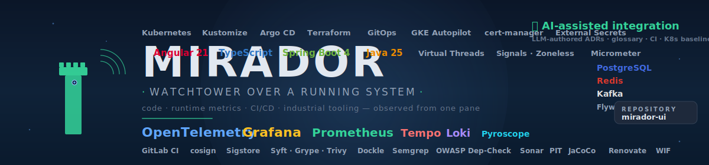

<!-- Build / release status — GitLab canonical, GitHub mirror for visibility. -->
[](https://gitlab.com/mirador1/mirador-ui/-/pipelines)
[](https://gitlab.com/mirador1/mirador-ui/-/releases)
[](https://github.com/Beennnn/mirador-ui/actions/workflows/codeql.yml)
[](https://scorecard.dev/viewer/?uri=github.com/Beennnn/mirador-ui)

<!-- Tech badges grouped by concern. Mirrors docs/reference/technologies.md
     and the banner SVG. Any bump here should also update both. -->

**Frontend**


**Observability (browser-side)**


**Backend (consumed)**


**Quality**


**CI / release**


> **Mirador** — Spanish for *watchtower* — is exactly what this project is:
> a vantage point over a real running system that lets you observe, in one
> place, **the code, the runtime metrics, the CI/CD pipelines, and the
> industrial tooling** wired around it. The UI is the front-row seat:
> health probes, traces, logs, quality reports, pipeline state, chaos
> actions, and live operational drill-down into the backend — backed by
> Grafana / Tempo / Loki / Prometheus for time-series observability.
>
> The repository is also a **concrete study in how far AI-assisted
> integration can go**. Every ADR, every CI hardening step, every
> supply-chain scanner, the K8s baseline, the observability wiring, the
> technology glossary and this README were authored in close
> collaboration with an LLM — the same technique keeps the docs, tests,
> and configuration in lockstep as the system grows.
>
> This repository is the **Angular 21 frontend**. The Spring Boot 4
> backend lives at [`mirador-service`](https://gitlab.com/mirador1/mirador-service).

---

## Documentation

All long-form documentation lives under [`docs/`](docs/README.md). This README stays thin —
the UI itself is the demo; the docs explain how to run it and what each page does.

| Topic                                                            | What you get                                                               |
| ---------------------------------------------------------------- | -------------------------------------------------------------------------- |
| [Architecture](docs/reference/architecture.md)                             | Mermaid diagram of Angular + backend + observability stack; core services  |
| [Quick start](docs/getting-started/quick-start.md)                               | Prereqs, cloning both repos, first-time boot                               |
| [`run.sh` reference](docs/getting-started/run-sh.md)                             | Every subcommand of the launcher                                           |
| [Environment configuration](docs/getting-started/environment.md)                 | `.env` reference for every variable                                        |
| [User manual](docs/guides/user-manual.md)                               | Per-feature walkthrough (Dashboard, Customers, Diagnostic, Chaos, …)       |
| [Keyboard shortcuts](docs/guides/keyboard-shortcuts.md)                 | Vim-style `G`+key navigation, `D` for dark mode, `?` for help              |
| [Theming & multi-environment](docs/guides/theming.md)                   | Dark/light toggle and Local/Docker/Staging/Prod switching                  |
| [Port map](docs/reference/ports.md)                                        | Every local URL exposed by the full stack                                  |
| [Proxy configuration](docs/ops/proxy.md)                             | `config/proxy.conf.json` rules and rationale                               |
| [Docker control API](docs/ops/docker-api.md)                         | `scripts/docker-api.mjs` endpoints                                         |
| [CI / CD](docs/ops/ci-cd.md)                                         | GitLab pipeline jobs + pre-push hook                                       |
| [Build & quality](docs/ops/build-quality.md)                         | npm scripts + bundle budgets                                               |
| [Technology glossary](docs/reference/technologies.md)                      | *(in progress)* exhaustive reference of every dep used in this repo        |

### Architecture decisions

Non-obvious choices are justified in ADRs under [`docs/adr/`](docs/adr/README.md):

- [0001 — Record architecture decisions](docs/adr/0001-record-architecture-decisions.md)
- [0002 — Zoneless change detection + Signals](docs/adr/0002-zoneless-and-signals.md)
- [0003 — Raw SVG for all visualizations, no charting library](docs/adr/0003-raw-svg-charts.md)
- [0004 — Vitest over Jest for unit tests](docs/adr/0004-vitest-over-jest.md)
- [0005 — Standalone components, no NgModules](docs/adr/0005-standalone-components.md)
- [0006 — Keep UI dashboards alongside Grafana (for now)](docs/adr/0006-grafana-duplication.md)
- [0007 — Retire Prometheus-fed UI visualisations in favour of Grafana](docs/adr/0007-retire-prometheus-ui-visualisations.md)

### Auto-generated API reference

- **Compodoc** (Angular-aware) — `npm run compodoc`, output in [`docs/compodoc/`](docs/compodoc/)
- **TypeDoc** (raw TypeScript) — `npm run typedoc`, output in [`docs/typedoc/`](docs/typedoc/)

### Sibling repo

- Backend: **[`mirador-service`](https://gitlab.com/mirador1/mirador-service)** — Spring Boot 4 / Java 25, lives as a sibling directory so `run.sh` can delegate infra commands.

---

## Project structure

```
mirador-ui/
├── src/
│   ├── main.ts                          # Application bootstrap (zoneless)
│   ├── styles.scss                      # Global styles + CSS custom properties
│   └── app/
│       ├── app.ts                       # Root component (renders AppShell)
│       ├── app.config.ts                # Angular providers (zoneless, router, HTTP + JWT interceptor)
│       ├── app.routes.ts                # Lazy-loaded feature routes (10 pages)
│       ├── core/                        # Singleton services (providedIn: 'root')
│       ├── features/                    # Lazy-loaded page components
│       └── shared/                      # Reusable UI components
├── scripts/
│   ├── docker-api.mjs                   # Node.js server — Docker control + Zipkin/Loki proxy
│   └── pre-push-checks.sh               # Git pre-push quality gate
├── config/
│   ├── proxy.conf.json                  # Angular dev server proxy rules
│   ├── typedoc.json                     # TypeDoc config
│   ├── .compodocrc.json                 # Compodoc config
│   └── sonar-project.properties         # SonarCloud config
├── build/
│   └── Dockerfile                       # Container build
├── deploy/
│   ├── nginx.conf                       # Runtime Nginx config
│   └── kubernetes/                      # K8s manifests
├── docs/                                # Hand-written docs + generated API reference
├── public/                              # Static assets (favicon, manifest, banner)
├── run.sh                               # Full-stack launcher (frontend + backend delegation)
├── angular.json                         # Angular CLI workspace config
└── tsconfig*.json                       # TypeScript configs (base / app / spec)
```

---

## Quick start

```bash
# Clone both repos as siblings (run from your dev root)
git clone https://gitlab.com/benoit.besson/mirador-service.git workspace-modern/mirador-service
git clone https://gitlab.com/benoit.besson/mirador-ui.git js/mirador-ui

# Start everything (Docker + backend + frontend) — one command
bash js/mirador-ui/run.sh
```

Sign in with **admin / admin** at <http://localhost:4200>. See [docs/getting-started/quick-start.md](docs/getting-started/quick-start.md) for prerequisites and troubleshooting.

---

## Tech stack (short version)

| Category          | Technology           | Details                                                                                         |
| ----------------- | -------------------- | ----------------------------------------------------------------------------------------------- |
| **Framework**     | Angular 21           | Standalone components, zoneless (`provideZonelessChangeDetection`), signals-based state         |
| **Language**      | TypeScript 5.9       | Strict mode enabled                                                                             |
| **Styling**       | SCSS                 | CSS custom properties for dark/light theming                                                    |
| **HTTP**          | Angular HttpClient   | Functional interceptor for JWT auth                                                             |
| **Routing**       | Angular Router       | Lazy-loaded feature modules via `loadComponent`                                                 |
| **State**         | Angular Signals      | No external state library — all state managed with `signal()`, `computed()`, `effect()`        |
| **Testing**       | Vitest               | Unit tests with jsdom environment                                                               |
| **Formatting**   | Prettier             | Enforced in CI and pre-push hook                                                                |
| **Charts**        | Raw SVG              | No charting library — all visualizations built with inline SVG                                  |
| **PWA**           | Web manifest         | Standalone installable app                                                                      |
| **Package manager** | npm 11             | Lockfile v3                                                                                     |

> The exhaustive list (Kaniko, hadolint, Trivy, Buildx, Keycloak, Loki, Tempo, Pyroscope, PostgreSQL, Kafka, Redis, Ollama, …) — with *what it is*, *how we use it* and *why it's pertinent* for each entry — lives in [docs/reference/technologies.md](docs/reference/technologies.md) (work in progress).
