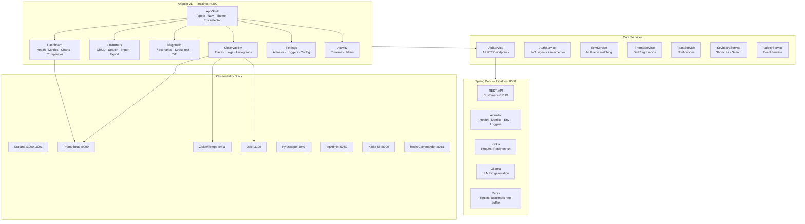

# Customer Observability UI

Angular 21 frontend that demonstrates and exercises every observable feature of the [`customer-service`](../workspace-modern/customer-service) Spring Boot backend.

## Architecture



### Detailed Architecture

The application follows a **standalone, zoneless Angular 21** architecture with signal-based state management. There are no NgModules — every component is standalone with explicit imports.

**Core layer** (`src/app/core/`) provides singleton services injected application-wide:

- **AuthService** — Manages JWT token in a signal backed by localStorage. A functional `HttpInterceptorFn` injects the `Authorization: Bearer` header on all requests except `/auth/login`.
- **ApiService** — Central HTTP client wrapping all backend endpoints. Uses a computed signal for `baseUrl` that reacts to environment changes. Supports search, sort, pagination, versioned APIs, idempotency keys, and CRUD operations.
- **EnvService** — Manages multi-environment switching (Local, Docker, Staging, Production) with localStorage persistence. Changing environment immediately updates all API calls.
- **ThemeService** — Dark/light theme toggle using CSS custom properties on `:root`. An `effect()` syncs the theme to both `localStorage` and the `data-theme` attribute on the document element.
- **ToastService** — Signal-based notification system with auto-dismiss. Supports success, error, warn, and info types.
- **KeyboardService** — Global keyboard shortcut handler. Supports `Ctrl+K` for search, `G+D/C/T` for navigation, `D` for dark mode, `R` for refresh, and `?` for help.
- **ActivityService** — In-memory event timeline that aggregates customer CRUD, health changes, diagnostic runs, environment switches, and bulk imports.

**Feature layer** (`src/app/features/`) contains lazy-loaded route components:

- **Dashboard** — Health probes (UP/DOWN badges), customer count, Prometheus metrics (req total, p50/p95/p99 latency), real-time HTTP throughput chart (SVG bar chart polling every 3s), health history sparkline, latency comparator between environments, and 11 observability stack links.
- **Customers** — Full CRUD with debounced search, sortable columns, paginated table with checkboxes for batch delete, edit/delete modals, CSV/JSON export, CSV/JSON bulk import with progress bar, idempotency key toggle, and per-customer detail panel (AI bio, todos, Kafka enrich).
- **Diagnostic** — 7 interactive scenarios (API versioning, idempotency, rate limiting, Kafka enrich, virtual threads, version diff, stress test), each with terminal-style log panel. Run All executes sequentially. History panel persists runs with export capability.
- **Observability** — Three tabs: Traces (queries Zipkin/Tempo API with span waterfall), Logs (queries Loki with live polling), Latency (Prometheus histogram distribution chart).
- **Settings** — Actuator endpoint explorer, Spring config properties viewer, logger level manager (live POST to change levels), bean count stats.
- **Activity** — Chronological event timeline with type-based filtering (create, update, delete, health, diagnostic, env, import).

**Shared layer** (`src/app/shared/`) contains the AppShell with responsive topbar, hamburger mobile menu, environment dropdown, theme toggle, keyboard shortcuts modal, and global search (Ctrl+K).

The app is PWA-ready with a web manifest for standalone installation.

## Purpose

The UI makes backend mechanisms **visible and interactive** without requiring curl or Postman:

- Health probes with live UP/DOWN indicators and auto-refresh
- Real-time HTTP throughput chart and latency metrics from Prometheus
- Full customer lifecycle with API versioning, pagination, search, sort, and idempotency
- Per-customer LLM bio, external Todos, and Kafka enrichment
- Interactive diagnostic scenarios with history, diff viewer, and stress testing
- Distributed traces from Zipkin/Tempo, live logs from Loki, latency histograms
- Backend configuration explorer with live logger level changes
- Activity timeline aggregating all user actions

## Prerequisites

| Dependency | Version |
|---|---|
| Node.js | >= 20 |
| npm | >= 10 |
| Angular CLI | installed via `npx` or globally |
| `customer-service` backend | running on `localhost:8080` |

Start the backend first:

```bash
# from workspace-modern/customer-service/
docker compose up -d          # PostgreSQL, Kafka, Redis, Ollama
docker compose -f docker-compose.observability.yml up -d   # Grafana, Prometheus, Tempo, Loki
./mvnw spring-boot:run
```

## Quick start

```bash
npm install
npm start          # dev server -> http://localhost:4200
```

Sign in with **admin / admin** (JWT issued by the backend's built-in auth).

## Screens

### Dashboard

Real-time health overview with metrics and monitoring.

- **Health probes** — `/actuator/health`, `/readiness`, `/liveness` with UP/DOWN badges
- **Stats cards** — customer count, HTTP request total, latency p50/p95/p99
- **Real-time chart** — SVG bar chart showing requests/second (polls every 3s)
- **Health sparkline** — visual history of health check results
- **Auto-refresh** — configurable polling (10s / 30s / 1min) with toast on state change
- **Latency comparator** — ping two environments side-by-side, compare avg/p95/errors
- **Observability links** — Grafana, Prometheus, Zipkin, Pyroscope, Swagger, pgAdmin, Kafka UI, Redis Commander, Keycloak

### Customers

Full customer management interface showcasing all backend capabilities.

| Feature | Endpoint | Notes |
|---|---|---|
| Create customer | `POST /customers` | Validation, RFC 9457 errors |
| Edit customer | `PUT /customers/{id}` | Modal form |
| Delete customer | `DELETE /customers/{id}` | Confirmation dialog |
| Batch delete | `DELETE /customers/{id}` x N | Checkbox selection |
| Search | `GET /customers?search=...` | Debounced 300ms |
| Sort | `GET /customers?sort=field,dir` | Clickable column headers |
| Idempotency | `POST /customers` + `Idempotency-Key` | LRU cache replay |
| List (v1) | `GET /customers` `X-API-Version: 1.0` | `{id, name, email}` |
| List (v2) | `GET /customers` `X-API-Version: 2.0` | Adds `createdAt` field |
| Summary projection | `GET /customers/summary` | SELECT id, name only |
| Recent customers | `GET /customers/recent` | Redis ring buffer (last 10) |
| Aggregate | `GET /customers/aggregate` | Virtual threads parallel tasks |
| AI bio | `GET /customers/{id}/bio` | Ollama llama3.2, circuit breaker |
| Todos | `GET /customers/{id}/todos` | JSONPlaceholder, resilience4j retry |
| Enrich | `GET /customers/{id}/enrich` | Kafka request-reply, 5s timeout |
| Export CSV/JSON | client-side | Download current page |
| Bulk import | client-side + POST | Upload CSV/JSON with progress |

### Diagnostic

Seven interactive scenarios with terminal-style logs, run history, and export.

| Scenario | What it shows |
|---|---|
| **API Versioning** | Side-by-side v1 vs v2 response |
| **Idempotency** | Same key sent twice — cached response, no duplicate |
| **Rate Limiting** | Concurrent burst — observe 429 responses |
| **Kafka Enrich** | Request-reply timing, 504 on timeout |
| **Virtual Threads** | Parallel backend tasks response time |
| **Version Diff** | Colored diff (green/red) between v1 and v2 responses |
| **Stress Test** | Sustained load with configurable duration/concurrency and live chart |

### Observability

Live backend telemetry with three tabs:

- **Traces** — Queries Zipkin/Tempo API, displays trace list with expandable span waterfall
- **Logs** — Queries Loki with LogQL, supports live polling every 5s, color-coded by level
- **Latency** — Fetches Prometheus histogram buckets, renders bar chart distribution

### Settings

Backend configuration explorer:

- **Config properties** — from `/actuator/env`, filtered for rate limit, Kafka, circuit breaker keys
- **Actuator explorer** — call any actuator endpoint and view the response
- **Loggers** — view and change log levels live via POST `/actuator/loggers/{name}`

### Activity

Chronological event timeline aggregating all actions in the current session. Filterable by event type (create, update, delete, health, diagnostic, env switch, import).

## Keyboard Shortcuts

| Shortcut | Action |
|---|---|
| `Ctrl+K` | Open global search |
| `?` | Show shortcuts help |
| `G D` | Go to Dashboard |
| `G C` | Go to Customers |
| `G T` | Go to Diagnostic |
| `G S` | Go to Settings |
| `G A` | Go to Activity |
| `R` | Refresh current page |
| `D` | Toggle dark/light mode |
| `Escape` | Close modal / search |

## Port map

| Service | URL |
|---|---|
| This UI | http://localhost:4200 |
| Backend API | http://localhost:8080 |
| Swagger UI | http://localhost:8080/swagger-ui.html |
| Grafana (metrics) | http://localhost:3000 |
| Grafana LGTM (traces/logs) | http://localhost:3001 |
| Prometheus | http://localhost:9090 |
| Zipkin / Tempo | http://localhost:9411 |
| Pyroscope | http://localhost:4040 |
| Loki | http://localhost:3100 |
| pgAdmin | http://localhost:5050 |
| Kafka UI | http://localhost:8090 |
| Redis Commander | http://localhost:8081 |
| Keycloak | http://localhost:9090/admin |

## Build

```bash
npm run build       # production bundle -> dist/
npm test            # vitest unit tests (22 tests)
```

## CI

GitHub Actions runs on push/PR to main:
- Node 20 + 22
- Unit tests
- Production build
