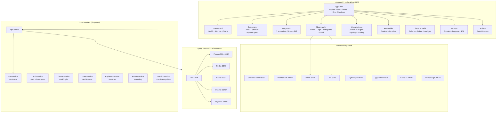

# Architecture

High-level view of the Mirador UI, the backend services it talks to, and the shared observability stack.

## Diagram

## Core Services

All services are Angular singletons (`providedIn: 'root'`) using signals for reactive state.

| Service | File | Role |
|---|---|---|
| **ApiService** | `core/api/api.service.ts` | Central HTTP client for all backend REST endpoints (customers CRUD, health, actuator, Kafka enrich, Ollama bio, etc.). Uses `EnvService` for dynamic base URL. |
| **AuthService** | `core/auth/auth.service.ts` | Manages JWT token in a signal + localStorage. Exposes `isAuthenticated` computed signal. |
| **Auth Interceptor** | `core/auth/auth.interceptor.ts` | Functional HTTP interceptor that attaches `Authorization: Bearer <token>` to all requests except login, docker-api, and proxy routes. |
| **EnvService** | `core/env/env.service.ts` | Manages the active backend environment (Local / Docker / Staging / Prod). Persisted in localStorage. All API calls dynamically use `env.baseUrl()`. |
| **ThemeService** | `core/theme/theme.service.ts` | Dark/light toggle. Sets `data-theme` attribute on `<html>` via an `effect()`. Persisted in localStorage. |
| **ToastService** | `core/toast/toast.service.ts` | Ephemeral notification toasts with auto-dismiss (4s default). Supports success, error, warn, info types. |
| **KeyboardService** | `core/keyboard/keyboard.service.ts` | Global keyboard shortcut handler. Supports Vim-style two-key sequences (`G` then `D` for Dashboard). Ignores shortcuts when focus is in input fields. |
| **ActivityService** | `core/activity/activity.service.ts` | In-memory event log (last 200 events). Tracks CRUD operations, health changes, diagnostic runs, imports. |
| **MetricsService** | `core/metrics/metrics.service.ts` | Persistent Prometheus polling (3s interval). Parses raw Prometheus text format to extract HTTP request counts and latency percentiles (p50/p95/p99) from histogram buckets. Singleton state survives navigation. |
